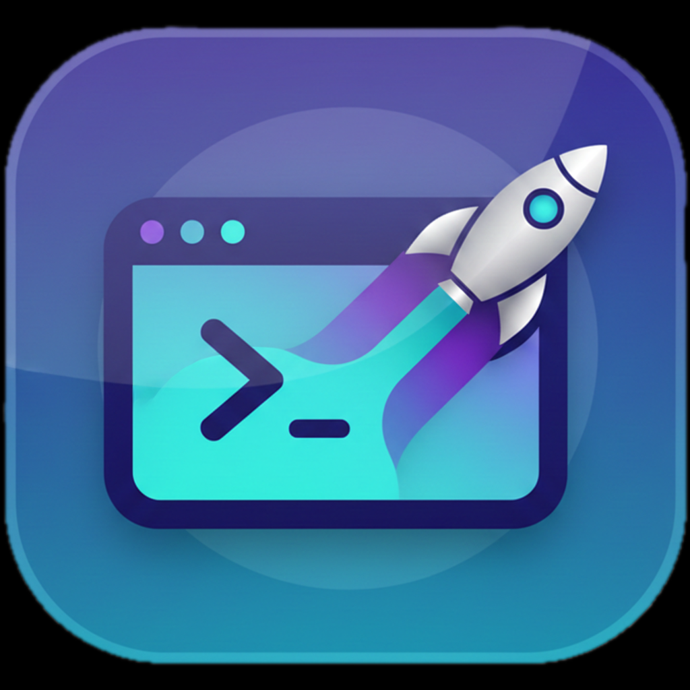
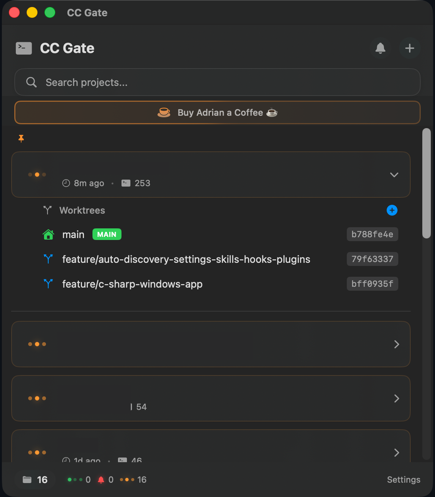
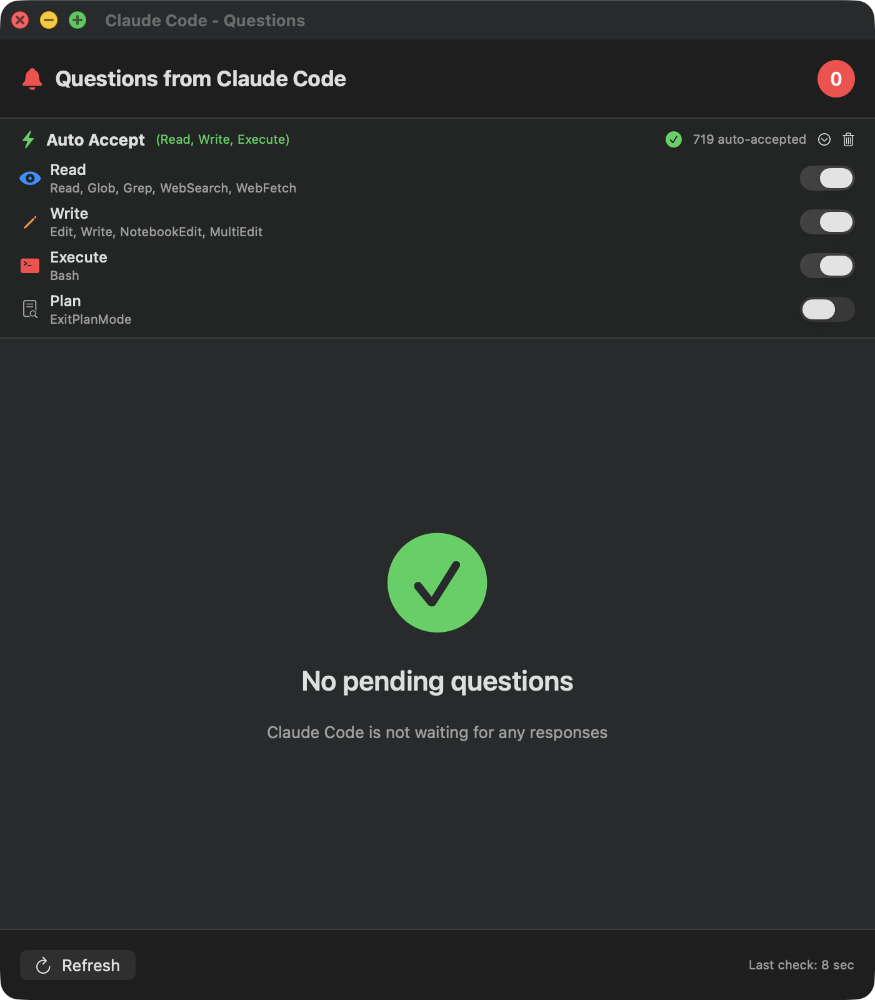

<p align="center">
  
</p>

<h1 align="center">CC Gate</h1>

<p align="center">
  <strong>The menu bar dashboard for Claude Code.</strong><br>
  Monitor all your projects, manage Git worktrees, run releases, analyze test coverage, and handle permissions — without switching windows.
</p>

<p align="center">
  <a href="https://github.com/ai-fresh/ccgate/releases/tag/LATEST"></a>
  
  
  
  <a href="LICENSE"></a>
</p>

<p align="center">
  <a href="#features">Features</a> ·
  <a href="#git-worktrees">Git Worktrees</a> ·
  <a href="#release-pipeline">Release Pipeline</a> ·
  <a href="#advanced-auto-accept">Auto-Accept</a> ·
  <a href="#pro">Pro</a> ·
  <a href="#installation">Installation</a> ·
  <a href="#faq">FAQ</a>
</p>

---

<p align="center">
  
  &nbsp;&nbsp;&nbsp;
  
</p>

<p align="center">
  <sub>Left: Menu bar dashboard — all projects, live status, Git worktrees. Right: 6-tier auto-accept and permission management.</sub>
</p>

---

## Why CC Gate?

Claude Code runs in a terminal window, one project at a time. CC Gate adds a persistent management layer on top:

- **Unified dashboard** — all projects, all sessions, all statuses in the menu bar
- **Git workflow** — worktrees, commit history, branch switching, stash manager, pull/push
- **Release automation** — tests → version bump → build → tag → GitHub Release in one flow
- **AI commits** — Claude analyses your diff and writes conventional commit messages (Pro)
- **6-tier auto-accept** — finer permission control than Claude Code's built-in setting
- **Background test runner** — auto-runs tests on file change, feeds results to Claude

## Features

### Multi-project Dashboard

All your Claude Code projects in one place. Per-project:
- **Live status** — active (green), waiting for input (orange/red), idle
- **Last activity** — "1s ago", "2m ago", "1d ago"
- **Session count** — parallel Claude Code instances per project
- **Quick search** — filter instantly across all projects

### Git Worktrees

Run multiple Claude Code sessions on separate branches of the same repo simultaneously.

- Create new worktrees with a 4-step wizard
- Switch between worktrees without leaving the menu bar
- Merge changes back to main
- Delete worktrees when done

### Git Operations

Full git workflow from native macOS sheets:
- Commit history browser
- Branch switcher
- Stash manager
- Pull / push
- Reset

No terminal required for day-to-day git work.

### GitHub Integration

- Push with one click
- View on GitHub, fork, clone
- PAT token stored securely in Keychain
- Context-menu shortcuts per project

### Release Pipeline

One-button release flow:

```
Tests → Version Bump → Build → Git Tag → GitHub Release
```

Supports Swift, JavaScript, Python, and C# projects. Integrates with your existing build scripts.

### CI/CD Pipeline Wizard

Interview-style creator for GitHub Actions workflows. Detects project type automatically (Swift, Node, Python, .NET) and generates the right jobs.

### Background Test Runner *(Developer Mode)*

Watches for file changes and auto-runs your test suite. Results surface in CC Gate and feed back into Claude Code — closing the edit-test-fix loop without context switching.

### Multi-Editor Support

Open any project in one click:
- Terminal, VS Code, Cursor, iTerm2, Warp, Finder
- Start new Claude Code sessions directly from the project card
- Launch in an existing or new Git worktree

---

## Advanced Auto-Accept

6 independently toggled permission tiers — more granular than Claude Code's built-in auto-accept.

| Tier | Tools | Risk |
|:-----|:------|:-----|
| **IDE** | MCP IDE tools (getDiagnostics, executeCode) | Minimal — IDE integration only |
| **Read** | Read, Glob, Grep, WebSearch, WebFetch, LS | Zero — read-only |
| **Write** | Edit, Write, MultiEdit, NotebookEdit | Low — reversible with git |
| **Execute** | Bash (all terminal commands) | High — full shell access |
| **Plan** | ExitPlanMode | Minimal — approves plans only |
| **Skill** | Skill tool | Depends on the skill invoked |

Each tier is an independent toggle. You can allow Read without Write, or enable IDE tools without touching Execute. Unknown tools always require manual approval.

> [!NOTE]
> Claude Code includes native auto-accept since early 2025. CC Gate extends it with 6 separate tiers and a native macOS UI — so you can keep fine-grained control even as Claude Code evolves.

> [!TIP]
> For most workflows, **Read + Write** gives a good balance of speed and safety. Enable **Execute** only when you trust the codebase. Keep **IDE** enabled for fast diagnostic feedback.

### Hook Architecture

CC Gate integrates via Claude Code's native **PermissionRequest hook** — no hacks, no terminal scraping:

```
Claude Code ──→ Permission Hook ──→ CC Gate ──→ Allow / Deny
                                       │
                                  Auto-accept
                                  (if tier enabled)
```

Hook is installed and managed entirely from the app UI. No manual config.

---

## Pro

Unlock AI-powered features with your own Anthropic API key.

| Feature | Free | Pro |
|:--------|:----:|:---:|
| Multi-project dashboard | ✓ | ✓ |
| Git worktrees | ✓ | ✓ |
| Git operations | ✓ | ✓ |
| GitHub integration | ✓ | ✓ |
| Release pipeline | ✓ | ✓ |
| CI/CD wizard | ✓ | ✓ |
| Background test runner | ✓ | ✓ |
| 6-tier auto-accept | ✓ | ✓ |
| **AI commit messages** | — | ✓ |

Activate via **Settings → Pro**. More Pro features in development — automatically available after launch.

---

## Installation

### Requirements
- macOS 13.0 (Ventura) or later
- Claude Code CLI installed and configured

### Steps

1. **Download DMG**
   - Get `CC Gate-X.Y.Z.dmg` from the [latest release](https://github.com/ai-fresh/ccgate/releases/latest)

2. **Install Application**
   - Open the DMG
   - **Drag** `CC Gate.app` to **Applications**

3. **Launch & Setup Hook**
   - Open **CC Gate** from Applications
   - Go to **Settings → Hook → Install** (one-time setup)

All Claude Code sessions from `~/.claude/projects/` will appear automatically.

---

## Quick Start

1. Click the terminal icon in your menu bar to open CC Gate
2. **Install the hook** — Settings → Hook → Install (one-time)
3. **Configure auto-accept** — open the Questions window (bell icon) and toggle tiers
4. **Start coding** — CC Gate monitors your sessions automatically

---

## Session Status

| Indicator | Status | Meaning |
|:---------:|:-------|:--------|
| 🟢 | Active | Claude is working (updated < 60s ago) |
| 🔔 | Waiting | Claude has a pending question |
| 🟠 | Idle | No recent activity (> 60s) |

---

## FAQ

<details>
<summary><strong>How is CC Gate different from Claude Code's built-in features?</strong></summary>

Claude Code runs in a terminal window per project. CC Gate adds features that Claude Code doesn't have natively:

- **Git worktree management** — create, switch, merge, delete without leaving the menu bar
- **Release pipeline** — test → version bump → build → tag → GitHub Release in one flow
- **Background test runner** — auto-runs tests on file change and feeds results to Claude
- **AI commit messages** — diff-aware conventional commits via Claude API (Pro)
- **6-tier auto-accept** — finer permission control than the built-in setting
- **Unified dashboard** — all projects, all sessions, all statuses in one place

</details>

<details>
<summary><strong>What's the difference between Free and Pro?</strong></summary>

Everything in the core app is free: the dashboard, Git worktrees, release pipeline, CI/CD wizard, background test runner, multi-editor support, and all 6 auto-accept tiers.

Pro unlocks AI-powered features that use the Anthropic API — currently AI Commit Messages, with more features coming. Activate via Settings → Pro with your own Anthropic API key.

</details>

<details>
<summary><strong>Is it safe to auto-accept Execute (Bash)?</strong></summary>

The Execute tier gives Claude full terminal access — it can run any command. Only enable it if you trust the codebase and the task Claude is working on. For most workflows, Read + Write gives a good balance of speed and safety.

</details>

<details>
<summary><strong>Does CC Gate work with multiple projects?</strong></summary>

Yes. CC Gate monitors all sessions in `~/.claude/projects/` and displays them in a single list. Search and pinning make it practical even with dozens of projects.

</details>

<details>
<summary><strong>What data does CC Gate collect?</strong></summary>

CC Gate reads local session data from `~/.claude/projects/`. No data is sent to external servers except when you use Pro features (which call the Anthropic API with your key). Everything stays on your Mac.

</details>

<details>
<summary><strong>The hook shows "not installed" after updating</strong></summary>

The hook signature changes between major versions. Go to **Settings → Hook → Uninstall**, then **Install** again. One-time step after an update.

</details>

---

## Contributing

Source code is available at [ccgate-source](https://github.com/ai-fresh/ccgate-source).

## License

MIT License — see [LICENSE](LICENSE) for details.

---

<p align="center">
  <sub>Built with SwiftUI for the Claude Code community</sub>
</p>
